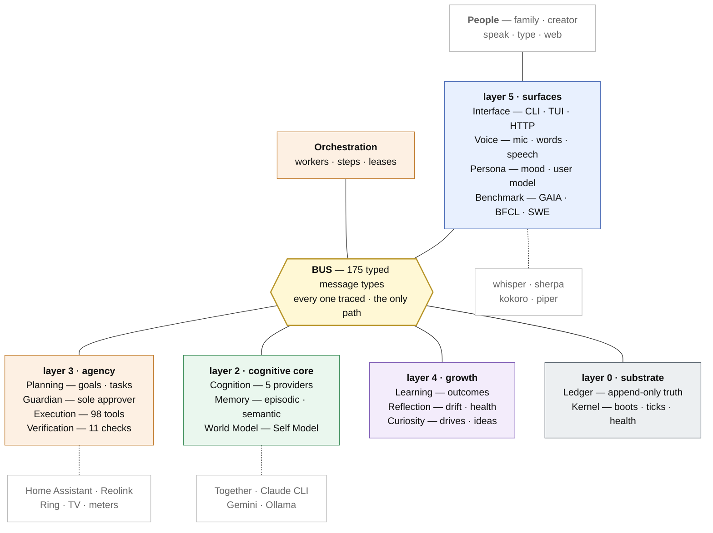
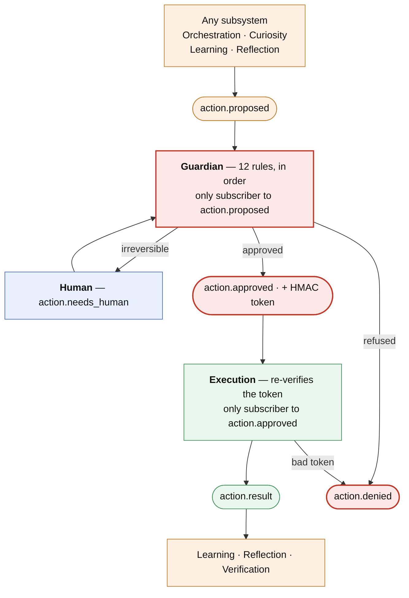
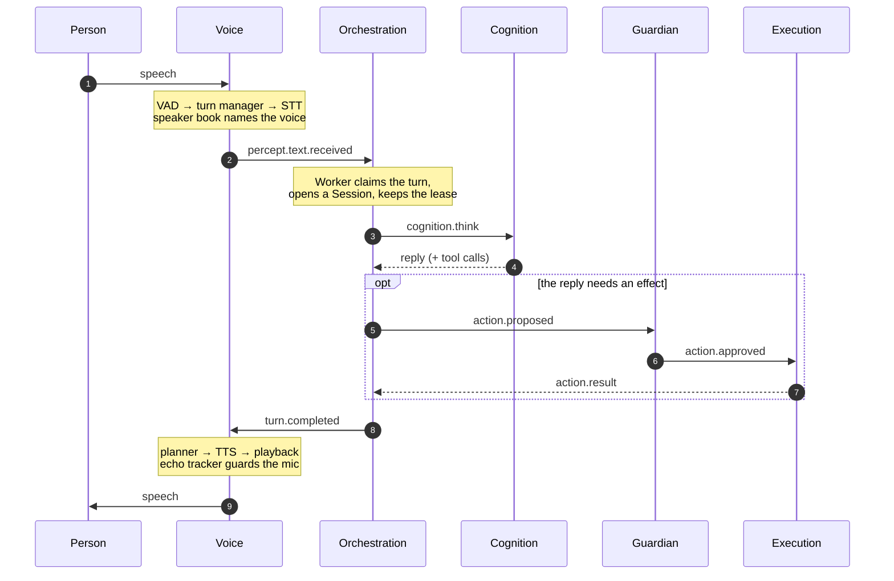
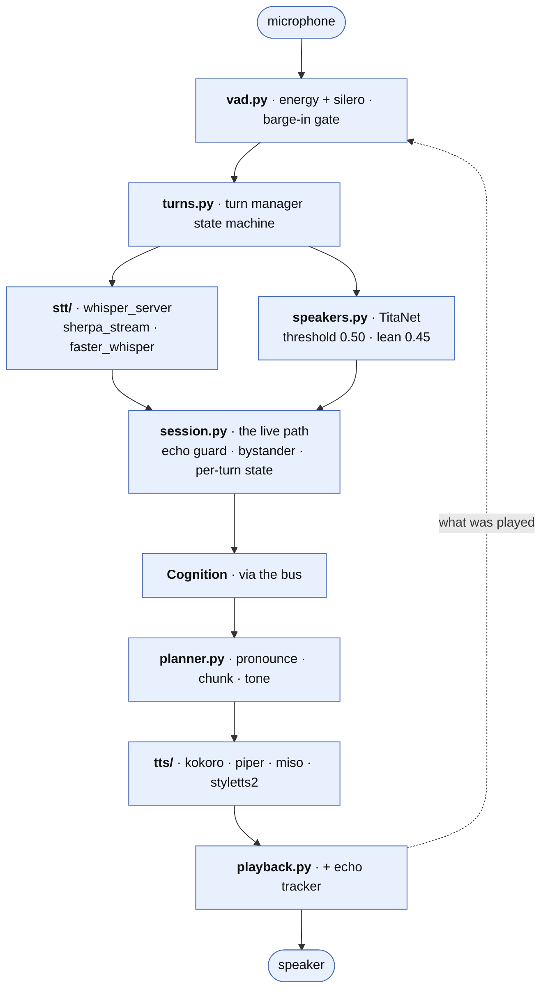

# Simorgh — Module Map and System Blocks

**What this is.** One picture of every major building block, what each one
owns, and how they interact — written so a single module can be picked up,
measured, and improved on its own. Read this before touching a subsystem;
read [`blueprint/`](blueprint/00-README.md) when you need the full spec of
one.

**How it was produced.** Read off the code as it stands on 2026-09-18, not
from the blueprint: layer order from `kernel/registry.py::LAYERS`, the
message edges by walking every `topics.*` reference in `simorgh/` and
classifying publish vs. subscribe, the enforced invariants from
`contracts/topics.py`, and the sizes from `wc -l`. Where this document and
the blueprint disagree, this one describes what runs and the blueprint
describes what was intended.

**Scale.** 18 subsystems, one package each, plus one shared dependency.
`simorgh/` is 86,994 lines across 382 files; `tests/` is 90,203 lines
across 447 test files. 175 topic constants, 174 checked-in JSON schemas.

**Also here.** The same four diagrams as standalone images in
[`images/`](images/) — JPG for pasting into anything, SVG for zooming —
and a slide deck over this material at
[`architecture-presentation.html`](architecture-presentation.html): open
it in a browser, arrow keys to move. The images are exported from the
mermaid blocks in this file, so they cannot drift from it silently.

---

## 1. The whole system, one screen

**Reading it.** Each coloured block is one layer; the modules named
inside it are separate packages, one per name — §5 and §6 take them one at
a time. No module calls another directly: every line through `BUS` is a
typed message, and every message is also an event in the `Ledger`. Dashed
boxes are outside the process. The one shared import is
`simorgh/contracts`, which everything depends on and which depends on
nothing.

**The two rules that make the picture trustworthy** (`contracts/topics.py`,
enforced by the Bus and proved at boot by `kernel/selfcheck.py`):

| Invariant | Enforcement |
|---|---|
| Only **Guardian** may subscribe to `action.proposed` | `SUBSCRIBE_ONLY_BY` |
| Only **Execution** may subscribe to `action.approved` | `SUBSCRIBE_ONLY_BY` |
| Only **Guardian**/Kernel may publish `action.approved` | `PUBLISH_ONLY_BY` |
| Only **Interface**/Kernel may publish `system.pause/stop/resume` | `PUBLISH_ONLY_BY` |
| Only **World Model** may publish `self.model.updated` | `PUBLISH_ONLY_BY` |
| Only **Planning** may publish `plan.proposed` | `PUBLISH_ONLY_BY` |

---

## 2. The action path — where safety actually lives

Every effect on the world is *proposed*, and exactly one subsystem can
turn a proposal into an effect. This is structural, not a policy anyone
has to remember.

The twelve rules, in order: **paused · mode · protected · scope ·
denylist · static analysis · shellcheck · package · grant · immunity ·
budget · reversibility** (`guardian/rules.py::DEFAULT_PIPELINE`).

Two details worth knowing before changing anything here: Guardian mints a
real HMAC token on approval and Execution verifies it *again* on its own
(`execution/verifier.py`), so a forged or replayed approval fails at the
second gate; and `execution` may itself publish `action.denied`, but only
with `layer: "token"` — a payload constraint the Bus enforces.

---

## 3. A spoken turn, end to end

The path Saeed and the family actually exercise every day.

Latencies, measured live on 2026-09-18: `stt` 1.8–6.8 s (whisper
large-v3-turbo), `llm` 1.3–9.5 s, first audio 0.5–2.3 s, full response
4–17 s.

---

## 4. Inside Voice — the subsystem under active work

Kept here because it is the one being improved module-by-module right now,
and because its internal pipeline is not obvious from the file list.

---

## 5. The module scorecard

Everything needed to choose what to work on next. `loc`/`tests` are
measured; **handle** is the suggested unit of measurement for that module
— what to put a number on before changing it.

| Module            | Layer |    loc | test files | Owns                                           | Benchmark handle                                              |
| ----------------- | ----- | -----: | ---------: | ---------------------------------------------- | ------------------------------------------------------------- |
| **execution**     | 3     | 21,590 |         60 | 98 tools, 6 domains, sandboxes, worktrees      | tool success rate per tool; p50/p95 latency; denial rate      |
| **voice**         | 5     | 11,233 |         45 | mic→words→speech, speaker ID                   | WER, speaker accuracy, response latency, echo false-positives |
| **interface**     | 5     | 10,747 |         30 | CLI/TUI, HTTP+dash, chat channels              | command coverage, render width correctness, API latency       |
| **contracts**     | —     |  6,443 |         22 | envelope, 175 topics, 174 schemas              | schema/consumer drift; unused constants                       |
| **orchestration** | X     |  5,600 |         30 | workers, claims, sessions, step budgets        | task success rate, steps per task, retries, lease expiries    |
| **kernel**        | —     |  4,045 |         19 | boot, layers, ticks, health, config, secrets   | boot time per layer, self-check coverage                      |
| **verification**  | 3     |  3,129 |         18 | 11 mechanical checks, plan review, rigor       | check hit rate, false-positive rate                           |
| **cognition**     | 2     |  3,119 |         14 | 5 providers, router, budgets, compaction       | tokens/$ per purpose, failover rate, cache hits               |
| **planning**      | 3     |  3,064 |         20 | goals→tasks, DAG, plan mode, re-grounding      | decomposition depth, blocked-retry counts                     |
| **benchmark**     | 5     |  2,813 |         17 | GAIA, BFCL, SWE-bench runners + history        | the suite scores themselves                                   |
| **ledger**        | 0     |  2,764 |         14 | append-only store, projections, compaction     | append latency, stream count, disk growth                     |
| **bus**           | 0     |  2,157 |         13 | routing, policy, enforcement, tracing          | delivery latency, policy violations, dropped handlers         |
| **reflection**    | 4     |  2,145 |         10 | drift, calibration, health, patterns           | findings per week, false-alarm rate                           |
| **memory**        | 2     |  1,880 |         12 | episodic/semantic store, recall, consolidation | recall@k for real questions, consolidation yield              |
| **guardian**      | 3     |  1,825 |         11 | the 12-rule approval pipeline, tokens          | approvals/denials per rule, human-gate rate                   |
| **curiosity**     | 4     |  1,402 |          9 | drives, ideas, interests, sharing              | proposals accepted vs. ignored                                |
| **worldmodel**    | 2     |  1,218 |          6 | env facets + Self Model projection             | staleness of each facet                                       |
| **learning**      | 4     |    992 |          5 | outcomes, competence, strategies, patches      | competence-estimate calibration                               |
| **persona**       | 5     |    797 |          3 | mood, emotion floor, user model, pacing        | proactive-share acceptance rate                               |

Two things this table says plainly. **Coverage is uneven relative to
size**: persona (3 test files), learning (5) and worldmodel (6) are the
thinnest, and all three feed the Self Model that everything else reads.
And **execution is a third of the codebase** — improving it means
improving tools one at a time, not the subsystem as a unit.

---

## 6. What each module is, and how it works

### Layer 0 — Substrate

**Bus** (`simorgh/bus/`) — the only way subsystems talk. Typed messages
with a trace id, wildcard subscriptions (`*` one segment, `#` the rest),
consumer groups for load-balanced commands, priority preemption for
`system.pause/stop/resume/restart`. Three backends: `memory`, `sqlite`,
`aws` (SNS/SQS). `enforcement.py` + `policy.py` are where the
publish/subscribe invariants are actually refused.
*Consumes* `subscribe-only-by` topology; *emits* `system.health`,
`system.metrics`.

**Ledger** (`simorgh/ledger/`) — append-only truth. Every status, rollup,
competence estimate and the Self Model itself are *projections* that can be
rebuilt from the log, so a crash loses process memory and nothing else.
Backends: `memory`, `jsonl`, `sqlite`, `dynamodb`; blobs separately.
Compaction runs on `system.tick.sleep`. Live streams today: `trace:<id>`
88,356 · `action:<id>` 26,737 · `task:<id>` 2,431 · `verify:<id>` 350 ·
`reflect:<id>` 310, ~1.4 GB.

**Kernel** (`simorgh/kernel/`) — the composition root, and the one module
permitted to import another subsystem's `Service` (`registry.py`). Boots
config → secrets → Ledger → Bus(policy) → each layer in order, waiting for
a layer's health before starting the next, so no Worker can claim a task
before Guardian and Execution are up. Also owns the clock ticks
(`second`, `idle`, `sleep`), the scheduler, `system.status`, scoped secret
stores, and the structural self-check. Shuts down in reverse layer order.

### Layer 2 — Cognitive core

**Cognition** (`simorgh/cognition/`) — the thinking. A router over five
provider adapters (`together`, `claude_code_cli`, `gemini`, `ollama`, and
a `floor` fallback) with per-provider rolling-window budgets replayed from
the Ledger, purpose filters (a provider may be allowed only for `chat`),
prompt assembly, tokenisation and context compaction. Cloud is the primary
brain; Ollama is fallback, not default.
*Consumes* `cognition.think`, `cognition.compact.request`;
*emits* `cognition.provider.status`, compaction events, `ui.notice`.

**Memory** (`simorgh/memory/`) — what Sim knows about what happened.
Episodic turns and semantic items with embeddings, recall, contradiction
flagging, and consolidation on `system.tick.sleep`.
*Consumes* `memory.store/retrieve/forget`, `turn.completed`;
*emits* `memory.stored`, `memory.consolidated`,
`memory.contradiction.flagged`.

**World Model** (`simorgh/worldmodel/`) — environment facets plus the
**Self Model**: identity, competence, calibration, limitations, change
history and skills, folded in real time from Learning and Reflection
events. It is the only publisher of `self.model.updated`, and the only
writer of the `self:model` projection — Reflection may only *observe*.
It subscribes to 19 topic types, more than any other module: it is the
system's mirror.

### Layer 3 — Agency

**Planning** (`simorgh/planning/`) — goals become tasks. Intake,
decomposition, a dependency DAG, dedupe, plan mode (propose → approve),
re-grounding a long plan against what changed, rollups, leases and the
blocked-retry ladder.
*Consumes* `intent.goal.stated`, `curiosity.candidate`, `plan.approved`,
`task.failed/blocked`; *emits* `plan.proposed/approved/revised`,
`task.created`, `task.blocked`, `project.completed/failed`.

**Guardian** (`simorgh/guardian/`) — the only approver, and the only
subscriber to `action.proposed`. Runs twelve rules in order — paused,
mode, protected, scope, denylist, static analysis, shellcheck, package,
grant, immunity, budget, reversibility — then mints an HMAC token. Also
owns posture and the charter.
*Emits* `action.approved/denied`, `action.needs_human`, `ui.prompt`.

**Execution** (`simorgh/execution/`) — the hands, and the largest module.
The only subscriber to `action.approved`; it re-verifies every token
independently before running anything. 98 tools registered at runtime
(114 classes exist; `run_shell` and `run_remote` stay off unless
configured), grouped as: files/code/git, sandboxes (python, js,
container), tests and patches, web (fetch, search, render, browse),
packages and scripts, plus six domain packages —
`knowledge/` (the creator's own documents, local),
`pim/` (calendar and mail, **read-only by construction**),
`security/` (advisory posture only),
`home/` (Home Assistant + Reolink cameras + Ring),
`energy/` (consumption, tariffs),
`media/` (Cast, Android TV, music).
Also worktrees, path/net safety, write-watching, MCP proposals.
*Emits* `action.result`, `tool.*`, `camera.event`, `tv.state`, `dash.*`.

**Verification** (`simorgh/verification/`) — did the work actually happen.
Eleven mechanical checks run cheapest-first, stopping at the first
failure: syntax, js syntax, docstring, invariants, denylist-immunity,
did-anything, full-suite-ran, isolated-suite, sandbox-smoke, render,
trailing-narration. Plus plan review, trajectory scoring and rigor
levels. It publishes only `verify.result` — it never proposes actions.

### Layer 4 — Growth

**Learning** (`simorgh/learning/`) — outcomes in, competence out. Records
every task outcome, maintains a competence table per task type, suggests
strategies, and runs the self-patch and skill-acquisition pipelines (the
path by which Sim changes its own code, gated by Guardian like anything
else).
*Emits* `learn.outcome.recorded`, `learn.competence.updated`,
`learn.self_patch.applied/reverted`, `learn.skill.acquired`.

**Reflection** (`simorgh/reflection/`) — observer only. Drift detection,
calibration, health findings, critique, denial analysis, pattern finding
and digests. It never writes `self:model` directly and never proposes an
action other than through the normal gate.

**Curiosity** (`simorgh/curiosity/`) — what to explore when nobody asked.
Drives, sampling for diversity, idea and project proposals, interests, and
the pacing of what it shares. One exploration tick at a time: a tick still
waiting on Cognition when the next `system.tick.idle` arrives is skipped
and recorded, never queued.

### Layer 5 — Self and surfaces

**Persona** (`simorgh/persona/`) — continuous mood, a rule-based emotion
floor, voice composition, the user model, and proactive-sharing pacing.
Deliberately never calls Cognition: it reacts to events and answers
`persona.voice` requests.

**Benchmark** (`simorgh/benchmark/`) — GAIA, GAIA-L1, BFCL, BFCL-parallel,
SWE-bench and SWE-bench-verified, with per-model history and a dashboard.
A run happens in a background task and narrates on `benchmark.progress`
because a GAIA run is tens of minutes.

**Voice** (`simorgh/voice/`) — see §4. Boot is cheap on purpose: engines
open on first use, so `voice status` works on a machine with no
microphone.

**Interface** (`simorgh/interface/`) — every human surface. The CLI REPL
and TUI, command parsing and dispatch, vitals, rendering (narration sized
from the real terminal width, never a constant), an HTTP API (21 distinct `/api/` paths plus page,
media and camera routes, dispatched by prefix), plus Telegram and
WhatsApp. It subscribes to 30 topic types — the widest reader in the
system — because its job is to show what everything else is doing.

### Cross-cutting

**Orchestration** (`simorgh/orchestration/`) — the workers that actually
do tasks. `config.workers` `Worker` instances share the `workers` consumer
group so `task.available` load-balances. Each claimed task gets a
`Session` with a step budget, think/tool timeouts, a lease heartbeat (so a
single slow step cannot let the lease expire and hand the task to a second
worker), scaffolds that shape how Sim thinks about a kind of work,
delegation to sub-tasks, and resume from the Ledger after a crash.

**Contracts** (`simorgh/contracts/`) — the single shared dependency, and
it depends on nothing. The message envelope, the 175-constant topic
catalog, the 174 JSON schemas that are the source of truth when prose
disagrees, subsystem protocols, settings, stream names, plus shared
vocabularies (household, places, tone, skills, home).

---

## 7. Where state lives

| Path | What | Size today |
|---|---|---|
| `~/.simorgh/ledger/` | every event, every stream, blobs | 1.4 GB |
| `~/.simorgh/execution/` | tool working state, worktrees, caches | 641 MB |
| `~/.simorgh/benchmarks/`, `benchmark-waves/` | run history | 12 MB |
| `~/.simorgh/interface/` | dash state, channel state | 536 KB |
| `~/.simorgh/<subsystem>/` | per-subsystem projections | mostly small |
| `~/.simorgh/simorgh.toml`, `secrets.toml` | config, secrets (never in git) | — |
| `workspace/voice/` | models, speaker book, kept audio | GB-scale |

Deployment modes: `mode = single | local-multi | aws`. In `local-multi`
the Kernel drops `orchestration` from its own layers so workers run as
separate processes.

---

## 8. Working one module at a time

The loop that fits this architecture, given that every module's inputs and
outputs are typed messages already recorded in the Ledger:

1. **Measure from the Ledger first, not from the code.** Every module's
   real behaviour is already on disk. Counting `speaker_score` across
   `voice:turns` is what showed 23 of 122 turns losing a name they had.
   Unit tests assert shape; the Ledger asserts behaviour.
2. **Pick the handle from §5** and write the number down before changing
   anything, in `docs/findings/`.
3. **Change one module.** Its blast radius is bounded by contracts: if the
   topics it publishes and consumes do not change, nothing else can break
   in a way the suite will not catch.
4. **Run that module's tests** while iterating (seconds), the full suite
   only before blessing.
5. **Re-measure the same handle**, and record the before/after.

The two structural traps found repeatedly in this codebase, both worth
checking in whichever module you pick up:

- **Unconnected wires** — a config key, field or switch with a write path
  and no read path. Twelve subsystems have had one.
- **Per-turn facts in session-level state** — a value belonging to one
  unit of work, kept in an instance attribute and read back after an
  `await`, by which time a newer unit has overwritten it.

---

*Diagrams are Mermaid and render on GitHub. Regenerate the numbers with
`wc -l`, `kernel/registry.py::LAYERS`, and a walk of `topics.*`
references; the method is described at the top of this file.*
